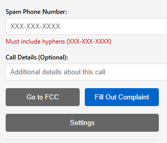
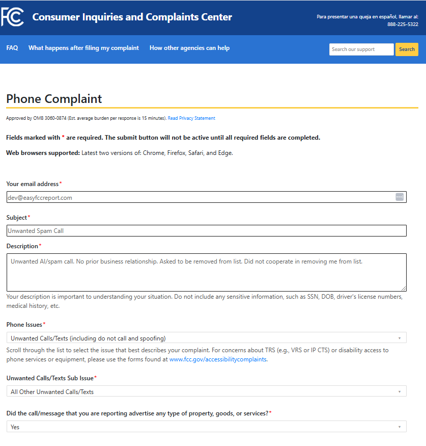

# Easy FCC Report

A Chrome extension to streamline the process of reporting spam calls to the FCC.

## Features
- One-click FCC complaint form filling
- Local storage of user information
- Customizable default complaint text
- Support for different phone types/locations
- Built-in Do Not Call List tracking

## Privacy
- All user information is stored locally in Chrome storage
- No data is ever transmitted to external servers
- Personal information is only used for filling FCC forms

## Installation
1. Clone this repository
2. Open Chrome and go to chrome://extensions/
3. Enable "Developer mode" in the top right
4. Click "Load unpacked" and select the extension directory

## Usage
1. Click the extension icon and go to Settings
2. Enter your information (stored locally in your browser)
3. When you receive a spam call:
   - Click the extension icon
   - Enter the spam phone number
   - Click "Fill Out Complaint"
   - Verify the information and submit

## License
MIT License - see LICENSE file for details

## Contact
For support or suggestions: dev@easyfccreport.com